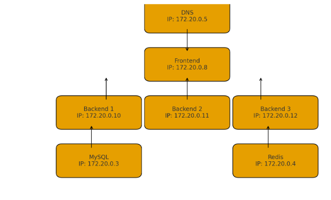

# BitBalance – Aplicação Distribuída com DNS Round Robin e Sessão Centralizada

Este projeto implementa uma arquitetura de três camadas distribuída com escalabilidade horizontal na camada de aplicação e persistência de sessão via Redis.
O sistema utiliza DNS Round Robin para balanceamento de carga entre múltiplos servidores HTTP (frontends), que por sua vez distribuem requisições para três servidores de aplicação (backends).

O objetivo é demonstrar, na prática, como manter usuários autenticados mesmo quando o tráfego é distribuído entre várias instâncias do backend, sem sticky sessions e sem load balancer L4/L7.

## Mapa da rede

Arquitetura da Solução

A estrutura implementada contém:

Servidor DNS (BIND9) realizando Round Robin entre 3 frontends.

3 servidores HTTP (frontends) com Nginx servindo HTML e atuando como reverse proxy.

3 servidores de backend com Node.js e Express.

Redis para armazenamento centralizado das sessões.

MySQL como banco de dados da aplicação.

Fluxo de requisição
Navegador → DNS RR → frontendX → backendY → Redis/MySQL

O DNS alterna entre três frontends.
Cada frontend utiliza Nginx para balancear requisições entre os três backends.
A sessão do usuário é salva no Redis, garantindo persistência mesmo quando o backend muda.

## Componentes do Sistema

### 1. DNS (Round Robin)

Arquivo de zona db.meutrabalho.com.br contém três registros A:

www IN A 172.20.0.20
www IN A 172.20.0.21
www IN A 172.20.0.22

Cada IP corresponde a um servidor HTTP independente.

TTL reduzido permite testar facilmente o balanceamento.

### 2. Frontend (Nginx)

Responsável por:

Servir a interface web (HTML, CSS e JS)

Encaminhar /login, /perfil e /status aos backends

Exibir informações do backend ativo

Cada frontend é idêntico, porém executado em containers diferentes.

### 3. Backend (Node.js + Express)

Funções principais:

Autenticação de usuário

Rota /perfil com nome, servidor e sessão

Rota /status usada pelo frontend

Conexão ao MySQL com retry automático

Persistência de sessão com Redis

As três instâncias do backend usam a mesma imagem, mas nomes diferentes através da variável:

SERVER_NAME=Servidor X

### 4. Redis

Armazena as sessões de forma centralizada:

Permite login único em todos os backends

Garante que a sessão não se perca após troca de servidor

### 5. MySQL

Contém a tabela users com usuários pré-cadastrados.

Arquivo init.sql cria banco, tabela e insere dois usuários.

Como Executar:

1. Subir os containers
docker compose down -v
docker compose build --no-cache
docker compose up -d

2. Configurar DNS da máquina cliente

O computador utilizado no teste deve usar o servidor DNS deste trabalho:

DNS primário: 172.20.0.5

3. Limpar o cache DNS

Windows:

ipconfig /flushdns

Chrome:

chrome://net-internals/#dns  →  Clear host cache

4. Acessar no navegador
http://www.meutrabalho.com.br

A página exibida virá de um dos três frontends.
Após login, limpar o cache DNS → atualizar a página.
O usuário permanece logado e o servidor exibido na tela muda conforme o backend escolhido pelo Nginx.

Requisitos atendidos:

3 servidores HTTP acessados via DNS RR

Sessão persistente independentemente da instância do backend

Backend distribuído e funcional

Banco e Redis integrados

Arquitetura de 3 camadas completa

Mapa da Rede
MySQL      172.20.0.3
Redis      172.20.0.4
DNS        172.20.0.5

Frontend1  172.20.0.20
Frontend2  172.20.0.21
Frontend3  172.20.0.22

Backend1   172.20.0.10
Backend2   172.20.0.11
Backend3   172.20.0.12

Pontos Extras

O projeto suporta reconfiguração automática caso um backend seja removido.
O Nginx detecta erro e redireciona a próxima requisição para outro backend.